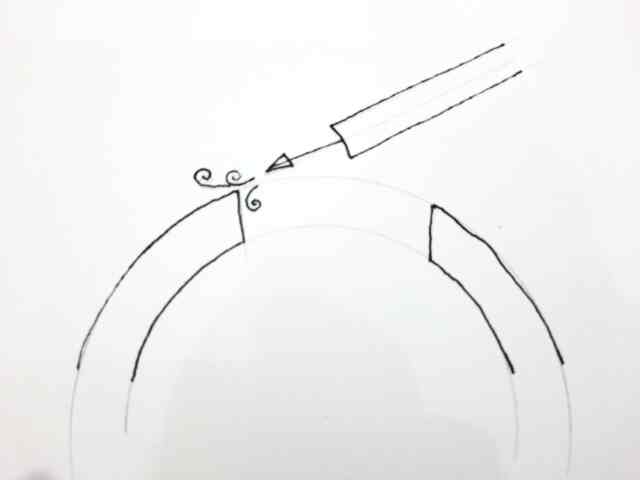

* flute-bore-visualizer
Clojure code to assist in comparing bores and tone holes in baroque flutes

- Models of extant baroque flutes
- Database
** Why?
The baroque flute represents the greatest sophistication of the simple flute, and if built and played well can give 3 fully chromatic octaves. However the subtlties of the creation of the bore to do this are no longer (if ever?) fully understood. Because of this modern reproductions are largely made as perfect copies of extant flutes, engineered to 0.1mm or finer tolerances.
Makers want to know things like: why one particular flute plays so well in the 3rd octave, and can this be achieved in a flute modelled on another historical example that has a better tone but is only good in the first two octaves. 
To do this we need a tool that can effectively compare the bore differences quickly and easily even though the 2 flutes in question are in different pitches.
We plan to cover 2 approaches to this:
*** Visual comparison of bores
To do this we need to display bore graphs for flutes under study, adjusted as necessary for any known pitch differences.
*** Fluid Dynamics Analysis
Given an accurate model of a flute we should be able to use CFD software to observe the differences and adjust the bore to optimise different notes. Hopefully this will achieve in minutes what would take days and considerable expense to achieve when running experiments by making new physical flute sections.

** Data Collection
Details of various extant historical flutes are available as technical drawings. These usually have the bore specified in a handwritten table detailing the bore diameter every 0.1mm along the whole length of the flute. The first step in the process is to extract these into a table for further processing. 

Because the measurements are taken for each individual section of the flute relative to some fixed point on that section of the flute we then need to massage the data so it tells us the bore diameters relative to a fixed point on the whole flute. The soundhole is an obvious choice here. Clojure could handle this, but as the raw data is extracted into an org-table just using org-table formulas is simpler. It is also trivial to convert the bore diameters to radii, which is more convenient for the modelling software.

Once the data is ready it is converted to edn to be fed into the clojure code. Although a script would be useful here so it can be automated when we need to correct omissions or errors in the raw data. As it is, AI followed by visual inspection makes a good enough job of doing the conversion.

** Embouchure Emulation
The players embouchure forms a narrow tube that directs air against the edge of the sound hole. To emaulate this we will use a tube. As a starting point we will make this oval, 9mm by 3mm, although this will need to be refined later, especial when exploring the higher registers. In general the higher the note, the tighter the players embouchure must be.

The players lip also covers some of the soundhole and this affects the tuning. We can explore this once the model is working.
