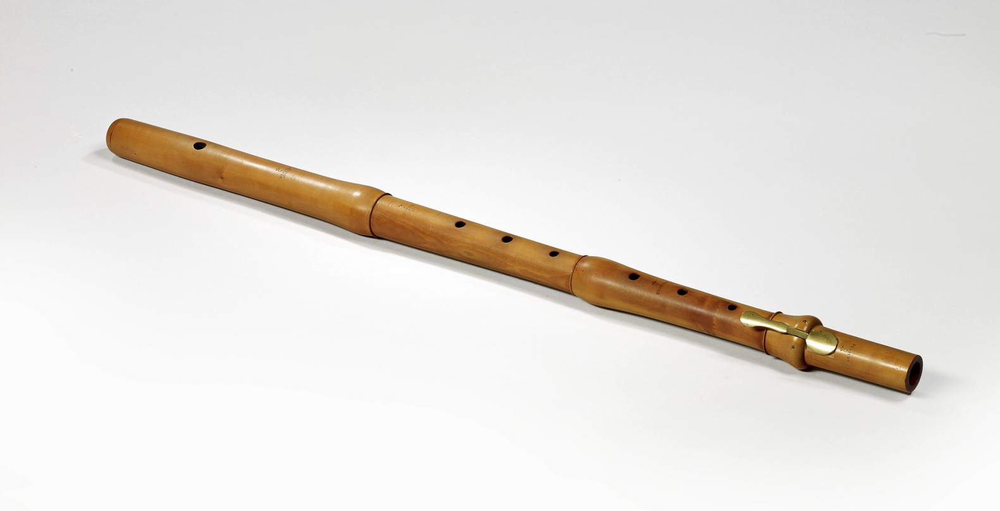
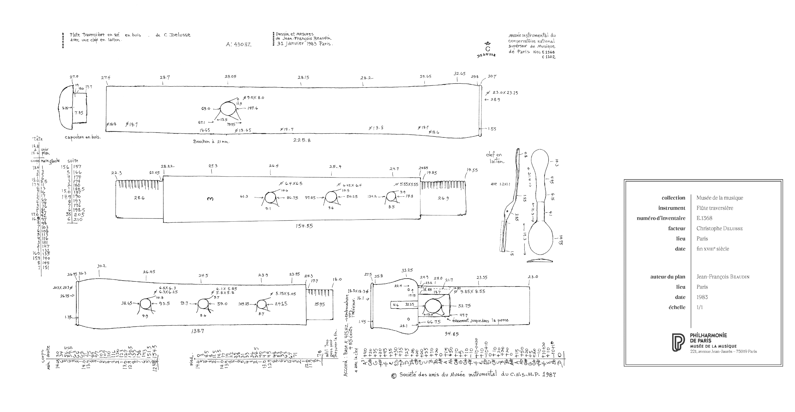
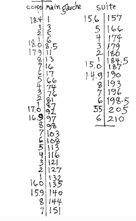
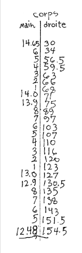
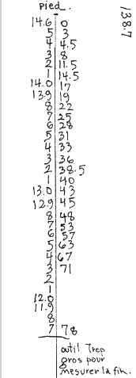

#+ATTR_ORG: :width 800  
 
#+ATTR_ORG: :width 1000

** Left hand joint
#+ATTR_ORG: :width 300

|----------+----------------------------|
| Diameter | Distance from end of tenon |
|----------+----------------------------|
|     18.4 |                          1 |
|     18.3 |                          3 |
|     18.2 |                          5 |
|     18.1 |                          6 |
|     18.0 |                        8.5 |
|     17.9 |                         11 |
|     17.8 |                         13 |
|     17.7 |                         16 |
|     17.6 |                         17 |
|     17.5 |                         66 |
|     17.4 |                         74 |
|     17.3 |                         76 |
|     17.2 |                         81 |
|     17.1 |                         87 |
|     17.0 |                         92 |
|     16.9 |                         97 |
|     16.8 |                         98 |
|     16.7 |                        103 |
|     16.6 |                        108 |
|     16.5 |                        113 |
|     16.4 |                        116 |
|     16.3 |                        121 |
|     16.2 |                        127 |
|     16.1 |                        132 |
|     16.0 |                        135 |
|     15.9 |                        140 |
|     15.8 |                        144 |
|     15.7 |                        151 |
|     15.6 |                        157 |
|     15.5 |                        166 |
|     15.4 |                        174 |
|     15.3 |                        179 |
|     15.2 |                        180 |
|     15.1 |                      184.5 |
|     15.0 |                        187 |
|     14.9 |                        190 |
|     14.8 |                        193 |
|     14.7 |                        196 |
|     14.6 |                      198.5 |
|    14.55 |                        205 |
|     14.6 |                        210 |
|----------+----------------------------|

** Right hand joint
#+ATTR_ORG: :width 200
 

|----------+------------------------------|
| Diameter | Distance from end of mortice |
|----------+------------------------------|
|    14.65 |                           30 |
|     14.6 |                           34 |
|     14.5 |                         56.5 |
|     14.4 |                         59.5 |
|     14.3 |                           63 |
|     14.2 |                           66 |
|     14.1 |                           68 |
|     14.0 |                           71 |
|     13.9 |                           75 |
|     13.8 |                           89 |
|     13.7 |                           97 |
|     13.6 |                          103 |
|     13.5 |                          107 |
|     13.4 |                          110 |
|     13.3 |                          116 |
|     13.2 |                          120 |
|     13.1 |                          123 |
|     13.0 |                          127 |
|     12.9 |                        130.5 |
|     12.8 |                          135 |
|     12.7 |                          138 |
|     12.6 |                          143 |
|     12.5 |                        151.5 |
|    12.48 |                        154.5 |
|----------+------------------------------|
** Foot joint
#+ATTR_ORG: :width 250
 
