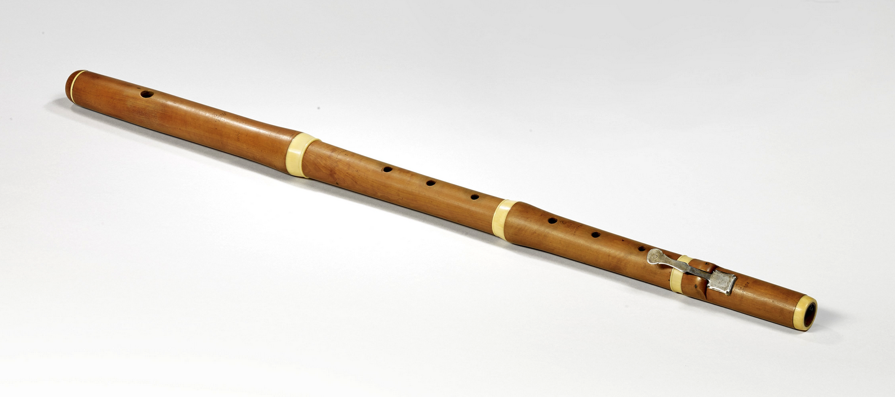
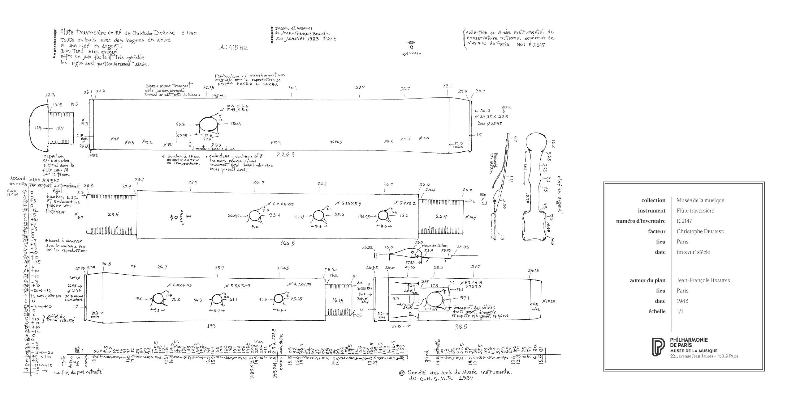
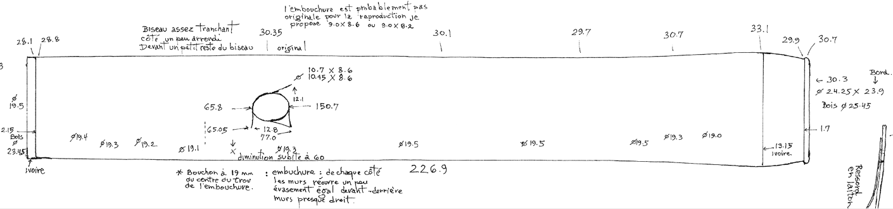
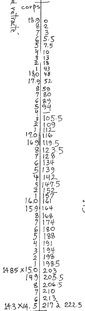
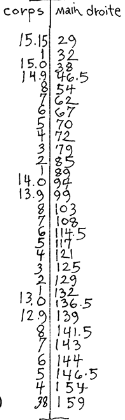
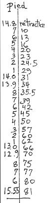

* Delusse E-2147
#+ATTR_ORG: :width 800

** Plan
#+ATTR_ORG: :width 1000

** Head Joint
There are some subtlties to the head joint bore described on the plan by diameter measurements place where they apply. There are no actual distance measurements provided so to make use of these would require measuring on the plan. This would be easy enough on an original paper copy, which would have been drawn at full size. This capture of an image would require careful scaling to make this work accurately.
For now we can use 19.0 throughout
*** Plan extract
#+ATTR_ORG: :width 1200

*** Data
** Middle Joint
*** Plan extract
#+ATTR_ORG: :width 200

*** Data
|----------+----------------------------|
| Diameter | Distance from end of tenon |
|----------+----------------------------|
|     18.9 |                          0 |
|     18.8 |                          2 |
|     18.7 |                          3 |
|     18.6 |                        5.5 |
|     18.5 |                        7.5 |
|     18.4 |                         10 |
|     18.3 |                         13 |
|     18.2 |                         18 |
|     18.1 |                         43 |
|     18.0 |                         48 |
|     17.9 |                         52 |
|     17.8 |                         59 |
|     17.7 |                         80 |
|     17.6 |                         89 |
|     17.5 |                         94 |
|     17.3 |                      105.5 |
|     17.2 |                        109 |
|     17.1 |                        112 |
|     17.0 |                        116 |
|     16.9 |                      119.5 |
|     16.8 |                      123.5 |
|     16.7 |                        128 |
|     16.6 |                        134 |
|     16.5 |                        139 |
|     16.4 |                        142 |
|     16.3 |                      147.5 |
|     16.2 |                        152 |
|     16.1 |                        157 |
|     16.0 |                        161 |
|     15.9 |                        164 |
|     15.8 |                        168 |
|     15.7 |                        174 |
|     15.6 |                        180 |
|     15.5 |                        188 |
|     15.4 |                        191 |
|     15.3 |                        194 |
|     15.2 |                        198 |
|     15.1 |                      198.5 |
|     15.0 |                        203 |
|     14.9 |                      205.5 |
|     14.8 |                      206.5 |
|     14.7 |                        210 |
|     14.6 |                        213 |
|     14.5 |                        217 |
|     14.5 |                      222.5 |
|-         |                            |
** Right Hand Joint
*** Plan extract
#+ATTR_ORG: :width 200

*** Data
|----------+------------------------------------|
| Diameter | Distance from outer end of mortice |
|----------+------------------------------------|
|    15.15 |                                 29 |
|     15.1 |                                 32 |
|     15.0 |                                 38 |
|     14.9 |                               46.5 |
|     14.8 |                                 54 |
|     14.7 |                                 62 |
|     14.6 |                                 67 |
|     14.5 |                                 70 |
|     14.4 |                                 72 |
|     14.3 |                                 79 |
|     14.2 |                                 85 |
|     14.1 |                                 89 |
|     14.0 |                                 94 |
|     13.9 |                                 99 |
|     13.8 |                                103 |
|     13.7 |                                108 |
|     13.6 |                              114.5 |
|     13.5 |                                117 |
|     13.4 |                                121 |
|     13.3 |                                125 |
|     13.2 |                                129 |
|     13.1 |                                132 |
|     13.0 |                              136.5 |
|     12.9 |                                139 |
|     12.8 |                              141.5 |
|     12.7 |                                143 |
|     12.6 |                                144 |
|     12.5 |                              146.5 |
|     12.4 |                                154 |
|    12.38 |                                159 |
|-         |                                    |
** Foot Joint
*** Plan extract
#+ATTR_ORG: :width 150

*** Data
|----------+-------------------------|
| Diameter | Distance from outer end |
|----------+-------------------------|
|     14.8 |                       0 |
|     14.7 |                      10 |
|     14.6 |                      13 |
|     14.5 |                      16 |
|     14.4 |                      20 |
|     14.3 |                      23 |
|     14.2 |                    24.5 |
|     14.1 |                      29 |
|     14.0 |                      31 |
|     13.9 |                      34 |
|     13.8 |                    35.3 |
|     13.7 |                      39 |
|     13.6 |                      42 |
|     13.5 |                      45 |
|     13.4 |                      50 |
|     13.3 |                      57 |
|     13.2 |                      60 |
|     13.1 |                      62 |
|     13.0 |                      66 |
|     12.9 |                      70 |
|     12.8 |                      75 |
|     12.7 |                      77 |
|     12.6 |                      80 |
|    15.55 |                      81 |
|----------+-------------------------|

