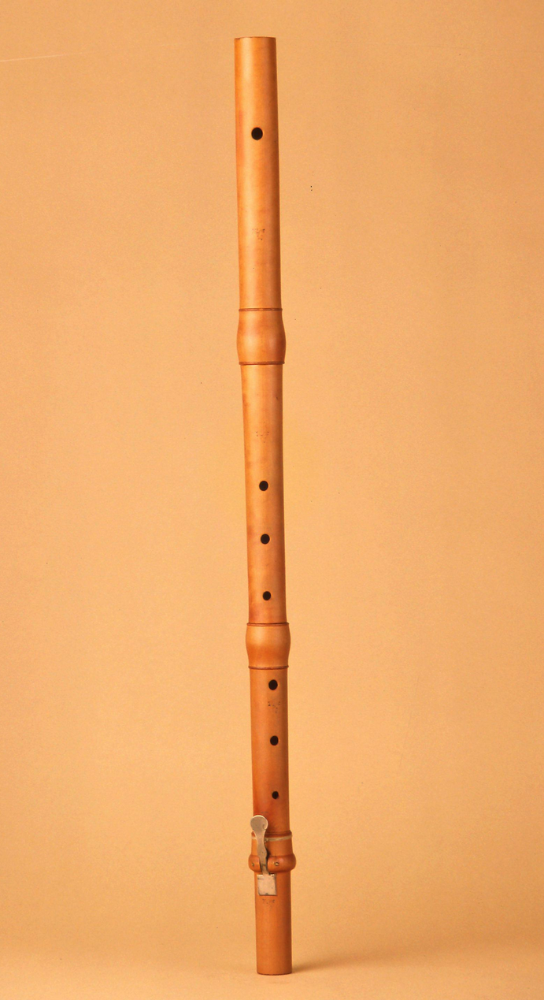
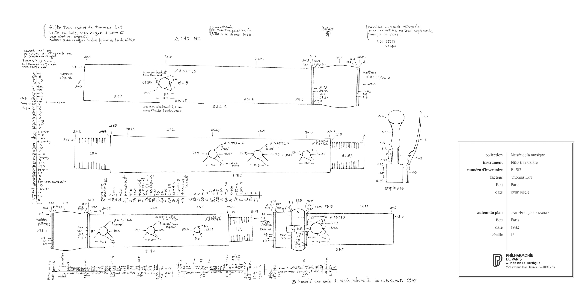
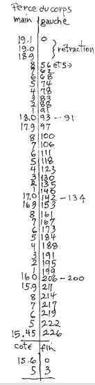
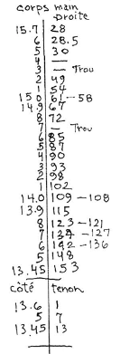
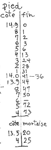

* Lot E1517
:PROPERTIES:
:ATTACH_DIR: /Users/iain/Code/ImmutableCollection/flute-bore-visualizer/models/images
:END:

** Plan
#+ATTR_ORG: :width 1000

** Head Joint
*** Plan Extract
[[file:images/Lot-E1517-bore1.png]]
*** Data
** Middle Joint
*** Plan Extract
#+ATTR_ORG: :width 150

*** Data
|----------+---------------|
| Diameter | Distance from |
|----------+---------------|
|     18.9 |             0 |
|     18.8 |            56 |
|     18.7 |            62 |
|     18.6 |            68 |
|     18.5 |            74 |
|     18.4 |            78 |
|     18.3 |            83 |
|     18.2 |            88 |
|     18.1 |            91 |
|     18.0 |            93 |
|     17.9 |            97 |
|     17.8 |           100 |
|     17.6 |           111 |
|     17.5 |           118 |
|     17.4 |           123 |
|     17.3 |           130 |
|     17.2 |           135 |
|     17.1 |           140 |
|     17.0 |           142 |
|     16.9 |           153 |
|     16.8 |           161 |
|     16.7 |           167 |
|     16.6 |          17.3 |
|     16.5 |           184 |
|     16.4 |           188 |
|     16.3 |           191 |
|     16.2 |           195 |
|     16.1 |           199 |
|     16.0 |           206 |
|     15.9 |           211 |
|     15.8 |           214 |
|     15.7 |           217 |
|     15.6 |           219 |
|     15.5 |           222 |
|    15.45 |           226 |
|     15.5 |           231 |
|     15.6 |        234.05 |
|----------+---------------|

** Right Hand Joint
*** Plan Extract
#+ATTR_ORG: :width 150

*** Data
|----------+------------------------------------|
| Diameter | Distance from outer end of mortice |
|----------+------------------------------------|
|     15.7 |                                 28 |
|     15.6 |                               28.5 |
|     15.5 |                                 30 |
|     15.2 |                                 49 |
|     15.1 |                                 54 |
|     15.0 |                                 58 |
|     15.0 |                                 61 |
|     14.9 |                                 67 |
|     14.8 |                                 72 |
|     14.6 |                                 85 |
|     14.5 |                                 87 |
|     14.4 |                                 90 |
|     14.3 |                                 93 |
|     14.2 |                                 98 |
|     14.1 |                                102 |
|     14.0 |                                108 |
|     14.0 |                                109 |
|     13.9 |                                115 |
|     13.8 |                                121 |
|     13.8 |                                123 |
|     13.7 |                                127 |
|     13.7 |                                134 |
|     13.6 |                                136 |
|     13.6 |                                142 |
|     13.5 |                                148 |
|    13.45 |                                153 |
|     13.5 |                                156 |
|     13.6 |                                162 |
|-         |                                    |
** Foot Joint
*** Plan Extract
#+ATTR_ORG: :width 150

*** Data
|----------+-------------------------|
| Diameter | Distance from outer end |
|----------+-------------------------|
|     14.9 |                       0 |
|     14.8 |                       1 |
|     14.7 |                       2 |
|     14.6 |                       3 |
|     14.5 |                       6 |
|     14.4 |                      13 |
|     14.3 |                      24 |
|     14.2 |                      28 |
|     14.1 |                      31 |
|     14.0 |                      36 |
|     14.0 |                      41 |
|     13.9 |                      44 |
|     13.8 |                      47 |
|     13.7 |                      50 |
|     13.5 |                      72 |
|     13.4 |                      73 |
|-         |                         |
