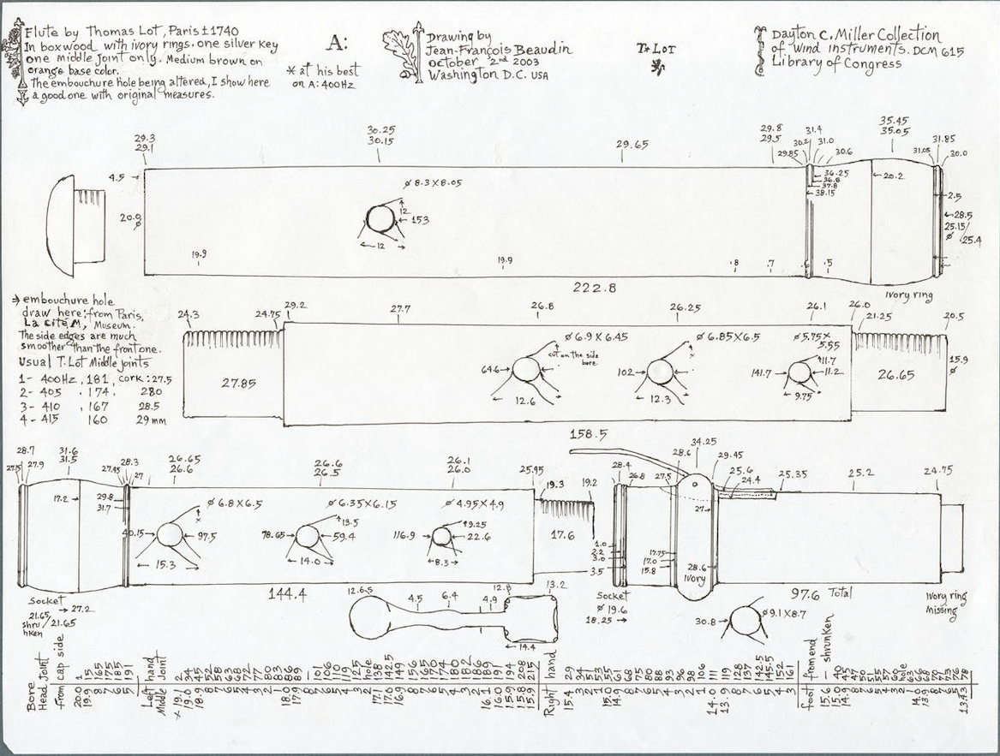

* Lot
:PROPERTIES:
:ATTACH_DIR: /Users/iain/Code/ImmutableCollection/flute-bore-visualizer/models/lot-images
:END:
Dayton Miller Collection DCM615. The Embouchore on this example was compromised, probably as part of an attempt to retune it. The measurements given here are from another Lot flute with the original embouchure.

** Bore Diameters
*** Head Joint
Original measurements taken from the cap end. Total length is *222.8mm* and the embouchure hole is *12mm* diameter and *153mm* from the lower end of the headjoint, measured to the lower edge of the embouchure hole. This gives a correction of -222.8 + 153 + 6 which is *-63.8mm*
|---------------+-------------------+-------------------------|
| Bore Diameter | Distance from cap | Distance from Soundhole |
|---------------+-------------------+-------------------------|
|          20.0 |                 1 |                   -62.8 |
|          19.9 |                15 |                   -48.8 |
|          19.8 |               165 |                   101.2 |
|          19.7 |               175 |                   111.2 |
|          19.6 |               185 |                   121.2 |
|          19.5 |               191 |                   127.2 |
|---------------+-------------------+-------------------------|
#+TBLFM: $3=$2-63.8
*** Middle Joint
Correction here is 153 + 6 - 28.5
|---------------+--------------------------+-------------------------|
| Bore Diameter | Distance from left tenon | Distance from soundhole |
|---------------+--------------------------+-------------------------|
|          19.1 |                        2 |                   132.5 |
|          19.0 |                       34 |                   164.5 |
|          18.9 |                       45 |                   175.5 |
|          18.8 |                       52 |                   182.5 |
|          18.7 |                       58 |                   188.5 |
|          18.6 |                       63 |                   193.5 |
|          18.5 |                       68 |                   198.5 |
|          18.4 |                       72 |                   202.5 |
|          18.3 |                       72 |                   202.5 |
|          18.2 |                       80 |                   210.5 |
|          18.1 |                       83 |                   213.5 |
|          18.0 |                       86 |                   216.5 |
|          17.9 |                       89 |                   219.5 |
|          17.7 |                      101 |                   231.5 |
|          17.6 |                      106 |                   236.5 |
|          17.5 |                      110 |                   240.5 |
|          17.4 |                      119 |                   249.5 |
|          17.3 |                      125 |                   255.5 |
|          17.1 |                      138 |                   268.5 |
|          17.0 |                    142.5 |                    273. |
|          16.9 |                      149 |                   279.5 |
|          16.8 |                      156 |                   286.5 |
|          16.7 |                      165 |                   295.5 |
|          16.6 |                      170 |                   300.5 |
|          16.5 |                      174 |                   304.5 |
|          16.4 |                      180 |                   310.5 |
|          16.3 |                      182 |                   312.5 |
|          16.2 |                      186 |                   316.5 |
|          16.1 |                      189 |                   319.5 |
|          16.0 |                      191 |                   321.5 |
|          15.9 |                      194 |                   324.5 |
|          15.8 |                      208 |                   338.5 |
|          15.9 |                      215 |                   345.5 |
|---------------+--------------------------+-------------------------|
#+TBLFM: $3=$2+130.5
*** Right Hand Joint
Correction is 153 + 6 + 158.5 = *317.5*
|---------------+----------------------------+-------------------------|
| Bore Diameter | distance from left mortice | Distance from soundhole |
|---------------+----------------------------+-------------------------|
|          15.4 |                         29 |                   346.5 |
|          15.3 |                         34 |                   351.5 |
|          15.2 |                         51 |                   368.5 |
|          15.1 |                         53 |                   370.5 |
|          15.0 |                         55 |                   372.5 |
|          14.9 |                         61 |                   378.5 |
|          14.8 |                         68 |                   385.5 |
|          14.7 |                         75 |                   392.5 |
|          14.6 |                         80 |                   397.5 |
|          14.5 |                         88 |                   405.5 |
|          14.4 |                         93 |                   410.5 |
|          14.3 |                         96 |                   413.5 |
|          14.2 |                         98 |                   415.5 |
|          14.1 |                        106 |                   423.5 |
|          14.0 |                        111 |                   428.5 |
|          13.9 |                        119 |                   436.5 |
|          13.8 |                        128 |                   445.5 |
|          13.7 |                        137 |                   454.5 |
|          13.6 |                      142.5 |                    460. |
|          13.5 |                      145.5 |                    463. |
|          13.4 |                        152 |                   469.5 |
|          13.3 |                        161 |                   478.5 |
|---------------+----------------------------+-------------------------|
#+TBLFM: $3=$2+317.5
*** Foot Joint
This section was measured the other way, so the correction will be 153 + 6 + 158.5 + 144.4 + 97.6 - <Distance from end>
*559.5 - $2*
|---------------+-------------------+-------------------------|
| Bore Diameter | Distance from end | Distance from soundhole |
|---------------+-------------------+-------------------------|
|          15.0 |                40 |                   519.5 |
|          14.9 |                45 |                   514.5 |
|          14.8 |                47 |                   512.5 |
|          14.7 |                50 |                   509.5 |
|          14.6 |                51 |                   508.5 |
|          14.5 |                55 |                   504.5 |
|          14.4 |                57 |                   502.5 |
|          14.3 |                60 |                   499.5 |
|          14.1 |                63 |                   496.5 |
|          14.0 |                66 |                   493.5 |
|          13.9 |                68 |                   491.5 |
|          13.8 |                70 |                   489.5 |
|          13.7 |                71 |                   488.5 |
|          13.6 |                73 |                   486.5 |
|          13.5 |                76 |                   483.5 |
|         13.43 |                78 |                   481.5 |
|---------------+-------------------+-------------------------|
#+TBLFM: $3=559.5-$2
** Holes
Distance from centre of soundhole to end of headjoint is 153 + 6 *159mm*
Holes are measured to the edge, so the centre must be found by adding half the longtitudonal diameter.
*** Heead Joint
|--------------+---------+-------------------------|
| Longitudonal | Lateral | distance from Soundhole |
|--------------+---------+-------------------------|
|           12 |      12 |                       0 |
|--------------+---------+-------------------------|

*** Middle Joint
|-------------------------+---------------+---------+-------------------------|
| Distance from Headjoint | Longtitudonal | Lateral | Distance from Soundhole |
|-------------------------+---------------+---------+-------------------------|
|                    64.6 |           6.9 |    6.45 |                  227.05 |
|                     102 |          6.85 |     6.5 |                 264.425 |
|                   141.7 |          5.75 |    5.55 |                 303.575 |
|-------------------------+---------------+---------+-------------------------|
#+TBLFM: $4=$1+159+($2/2)
*** Right Hand Joint
Correction is *159* for the head joint and *158.5* for the middle joint.
|------------------------+---------------+---------+-------------------------|
| Distance from LH Joint | Longtitudonal | Lateral | Distance from Soundhole |
|------------------------+---------------+---------+-------------------------|
|                  40.15 |           6.8 |     6.5 |                  361.05 |
|                  78.65 |          6.35 |    6.15 |                 399.325 |
|                  116.9 |          4.95 |     4.9 |                 436.875 |
|------------------------+---------------+---------+-------------------------|
#+TBLFM: $4=$1+($2/2)+159+158.5
*** Foot Joint
Correction is *159* + *158.5* + *144.4*
|------------------------+---------------+---------+-------------------------|
| Distance from RH Joint | Longtitudonal | Lateral | Distance from Soundhole |
|------------------------+---------------+---------+-------------------------|
|                   30.8 |           9.1 |     8.7 |                  497.25 |
|------------------------+---------------+---------+-------------------------|
#+TBLFM: $4=$1+($2/2)+159+158.5+144.4
